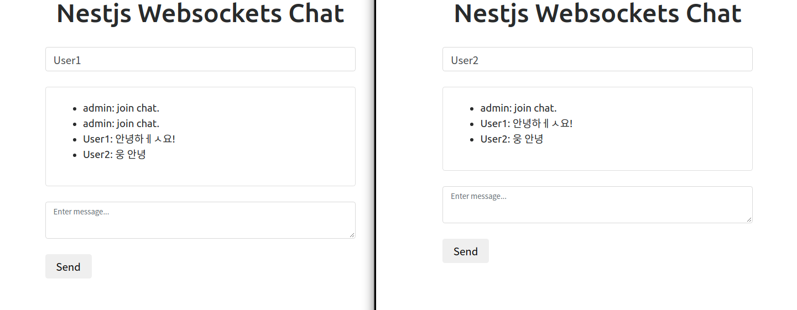

# Redis Clustering NestJS Chat App

~~누가 언제 어디서 무엇을 어떻게 왜~~

최근 회사 프로젝트를 진행하면서 Chatting 모듈을 만들 기회가 찾아왔다.

운영하는 서버는 사용량에 따라 서버의 대수를 늘리는 Scale Out을 하여 능력을 향상시킨다.
서버가 여러대로 늘어감에 따라 소켓 서버들간에 데이터를 주고받을 수 있는 중간 서버가 필요해진다.

해결책으로 `Redis`의 `PUB/SUB` 기능을 사용하여 소켓간의 메시지를 관리할 것 이다.

서버는 Node.js 프레임워크 `NestJS`를 사용하고, 채팅에 필요한 소켓은 `Socket.io` 라이브러리를 이용한다.

이는 나중에 Redis와 Socket를 Adapter Pattern으로 적용하기 편리해지기 때문이다. 그리고 각 서버들은 `Docker`를 이용하여 실행한다.

## 📋 TODO

- [ ] Set up Docker
- [ ] Set up Chatting Application
- [ ] Apply Websocket Adapter
- [ ]

## 1. Set up Docker

`Docker-Compose` 로 Redis 환경을 구성한다.

```yml
// docker-compose.yml

version: '3'

services:
  redis:
    image: redis
    restart: always
    container_name: ilyong-redis
    ports:
      - 10300:6379
```

`$ docker-compose up -d` 명령어를 사용하여 Redis Docker Image를 실행한다.

```powershell
$ docker-compose up -d
Creating network "nestjs-socketio_default" with the default driver
Pulling redis (redis:)...
latest: Pulling from library/redis
a076a628af6f: Pull complete
f40dd07fe7be: Pull complete
ce21c8a3dbee: Pull complete
ee99c35818f8: Pull complete
56b9a72e68ff: Pull complete
3f703e7f380f: Pull complete
Digest: sha256:0f97c1c9daf5b69b93390ccbe8d3e2971617ec4801fd0882c72bf7cad3a13494
Status: Downloaded newer image for redis:latest
Creating ilyong-redis ... done
```

`$ docker ps` 로 상태를 확인한다.

```sh
$ docker ps
CONTAINER ID   IMAGE     COMMAND                  CREATED         STATUS         PORTS                     NAMES
959e05e10871   redis     "docker-entrypoint.s…"   7 seconds ago   Up 6 seconds   0.0.0.0:10300->6379/tcp   ilyong-redis
```

## 2. Set up Chatting Application

### Generate NestJS

```sh
$ nest new nestjs-socketio
$ nest generate module chat
$ nest generate gateway chat chat
```

### Install package

- NestJS WebSocket 관련 package를 설치해줍니다.

  ```sh
  $ npm i --save @nestjs/websockets @nestjs/platform-socket.io
  ```

### Setting Up Chatting Application

- 환경 변수를 사용하기위해 `@nestjs/config` package를 설치해줍니다.

  ```sh
  $ npm i --save @nestjs/config joi
  ```

  ```ts
  // src/app.module.ts

  @Module({
    imports: [
      ConfigModule.forRoot({
        envFilePath: `.env`,
        validationSchema: Joi.object({
          NODE_PORT: Joi.string().required(),
          REDIS_PORT: Joi.string().required(),
          REDIS_HOST: Joi.string().required(),
        }),
      }),
      ChatModule,
    ],
    controllers: [AppController],
    providers: [AppService],
  })
  ```

- Gateway를 사용하여 WebSocket 통신 모듈을 구현합니다.

  ```ts
  // src/chat.gateway.ts

  import { Logger } from '@nestjs/common';
  import {
    OnGatewayConnection,
    OnGatewayDisconnect,
    OnGatewayInit,
    SubscribeMessage,
    WebSocketGateway,
    WebSocketServer,
  } from '@nestjs/websockets';
  import { Server, Socket } from 'socket.io';

  @WebSocketGateway({ namespace: 'chat' })
  export class ChatGateway
    implements OnGatewayConnection, OnGatewayDisconnect, OnGatewayInit {
    private static readonly logger = new Logger(ChatGateway.name);

    @WebSocketServer()
    server: Server;

    afterInit() {
      ChatGateway.logger.debug(`Socket Server Init Complete`);
    }

    handleConnection(client: Socket) {
      ChatGateway.logger.debug(
        `${client.id}(${client.handshake.query['username']}) is connected!`,
      );

      this.server.emit('msgToClient', {
        name: `admin`,
        text: `join chat.`,
      });
    }

    handleDisconnect(client: Socket) {
      ChatGateway.logger.debug(`${client.id} is disconnected...`);
    }

    @SubscribeMessage('msgToServer')
    handleMessage(
      client: Socket,
      payload: { name: string; text: string },
    ): void {
      this.server.emit('msgToClient', payload);
    }
  }
  ```

- NestJS 서버에서 정적 파일을 사용하도록 설정하고, VueJS로 간단히 만든 채팅 페이지를 불러오도록 합니다.

  ```ts
  // src/main.ts

  async function bootstrap() {
    const app = await NestFactory.create<NestExpressApplication>(AppModule);
    app.useStaticAssets(join(__dirname, '..', 'static'));
    await app.listen(3000);
  }
  bootstrap();
  ```

  ```html
  <!-- assets/index.html -->

  <!DOCTYPE html>
  <html lang="en">
    <head>
      <meta charset="UTF-8" />
      <meta name="viewport" content="width=device-width, initial-scale=1.0" />
      <meta http-equiv="X-UA-Compatible" content="ie=edge" />
      <link
        rel="stylesheet"
        href="https://maxcdn.bootstrapcdn.com/bootstrap/4.0.0-alpha.6/css/bootstrap.min.css"
        integrity="sha384-rwoIResjU2yc3z8GV/NPeZWAv56rSmLldC3R/AZzGRnGxQQKnKkoFVhFQhNUwEyJ"
        crossorigin="anonymous"
      />
      <title>Nestjs SocketIO</title>
      <link rel="stylesheet" href="styles.css" />
      <script src="https://cdn.jsdelivr.net/npm/vue/dist/vue.js"></script>
      <script
        type="text/javascript"
        src="https://cdn.socket.io/socket.io-1.4.5.js"
      ></script>
    </head>
    <body>
      <div id="app" class="container">
        <div class="row">
          <div class="col-md-6 offset-md-3 col-sm-12">
            <h1 class="text-center">{{ title }}</h1>
            <br />
            <div id="status"></div>
            <div id="chat">
              <input
                type="text"
                v-model="name"
                id="username"
                class="form-control"
                placeholder="Enter name..."
              />
              <br />
              <div class="card">
                <div id="messages" class="card-block">
                  <ul>
                    <li v-for="message of messages">
                      {{ message.name }}: {{ message.text }}
                    </li>
                  </ul>
                </div>
              </div>
              <br />
              <textarea
                id="textarea"
                class="form-control"
                v-model="text"
                placeholder="Enter message..."
              ></textarea>
              <br />
              <button id="send" class="btn" @click.prevent="sendMessage">
                Send
              </button>
            </div>
          </div>
        </div>
      </div>

      <script src="main.js"></script>
    </body>
  </html>
  ```

  ```js
  // assets/main.js

  const app = new Vue({
    el: '#app',
    data: {
      title: 'Nestjs Websockets Chat',
      name: '',
      text: '',
      messages: [],
      socket: null,
    },
    methods: {
      sendMessage() {
        if (this.validateInput()) {
          const message = {
            name: this.name,
            text: this.text,
          };
          this.socket.emit('msgToServer', message);
          this.text = '';
        }
      },
      receivedMessage(message) {
        this.messages.push(message);
      },
      validateInput() {
        return this.name.length > 0 && this.text.length > 0;
      },
    },
    created() {
      this.socket = io('http://localhost:3000/chat');
      this.socket.on('msgToClient', (message) => {
        this.receivedMessage(message);
      });
    },
  });
  ```

  ```css
  <!-- assets/style.css -- > #messages {
    height: 300px;
    overflow-y: scroll;
  }

  #app {
    margin-top: 2rem;
  }
  ```

  

## 3. Apply Websocket Adapter

### Redis PUB/SUB

같은 서버가 Scale Out 하여 서버대수가 늘어나면 연결된 socket들도 분리가 됩니다. 이 때 Socket들을 관리해줄 중간 서버가 필요한데, 이는 Redis의 `PUB/SUB` 기능을 사용하여 관리합니다.

- NestJS 서버의 [WebSocket Adapter](https://docs.nestjs.com/websockets/adapter)를 적용합시다.

  WebSocket 모듈은 `platform-agnostic` 입니다.

  > **platform-agnostic 이란?**
  >
  > 작동 시스템에 대한 아무런 지식이 없더라도 기능을 수행할 수 있도록 하는 기술.
  > 예를 들어, 플랫폼 애그노스틱(platform-agnostic) 소프트웨어 기술은 어떠한 운영 체제나 프로세서의 조합인지에 대한 아무런 지식이 없더라도 상관없이 기능을 수행할 수 있는 소프트웨어 기술을 의미한다.
  >
  > ([한국정보통신기술협회-애그노스틱기술](http://www.tta.or.kr/data/weeklyNoticeView.jsp?pk_num=5179))

  따라서 사용자의 라이브러리나 소스를 컴파일하는 데 필요한 종속성들을 `WebSocketAdpater` 인터페이스를 만들어 사용함으로써 같이 사용할 수 있습니다.

  NestJS의 `socket.io` package는 `IoAapter` 클래스안에 래핑되었습니다. 현재 개발할려는 채팅 어플리케이션은 인스턴스가 가변적인 예제이기 때문에, `IoAdapter`를 상속받고 새로운 socket.io 서버를 인스턴스로 만드는 `createIoServer` method를 override 할 수 있습니다.

- 그전에 필요한 package를 설치합시다.

  ```sh
  $ npm i --save socket.io-redis
  ```

- 설치를 완료했다면 `RedisIoAdapter` Class를 만듭시다.

  ```ts
  // src/chat/redis.adapter.ts

  export class RedisIoAdapter extends IoAdapter {
    createIOServer(port: number, options?: ServerOptions): any {
      const server = super.createIOServer(port, options);
      server.adapter(
        redisIoAdapter.createAdapter(
          `redis://${process.env.REDIS_HOST}:${process.env.REDIS_PORT}`,
        ),
      );
      return server;
    }
  }
  ```

- 그 후에, `userWebSocketAdapter()` method로 새롭게 만들어진 Redis adapter를 적용합시다.

  ```ts
  // src/main.ts
  // ...
  const app = await NestFactory.create(ApplicationModule);
  app.useWebSocketAdapter(new RedisIoAdapter(app));
  // ...
  ```

> **참고** 💡
>
> `socket.io-redis`는 `Socket.IO` server version과 대응해줘야합니다. 현재 예제에서, `socket.io-redis`의 version은 `5.4.0`을, `socket.io` version는 package-lock.json을 확인한 결과, `@nestjs/platform-socket.io` package를 설치하면 `2.4.1` version의 `socket.io`가 설치됩니다.
>
> [참고사이트](https://github.com/socketio/socket.io-redis#compatibility-table)

### Test
